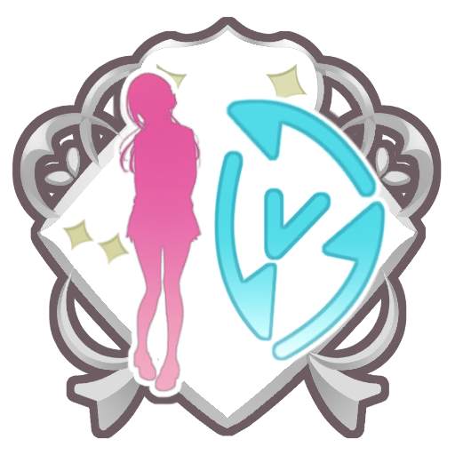
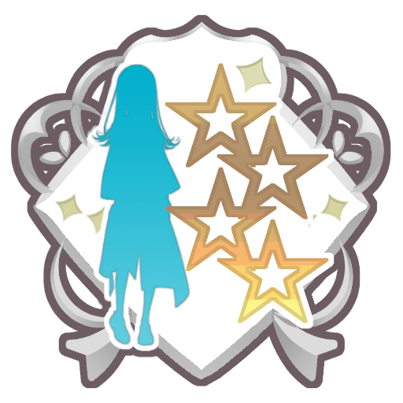
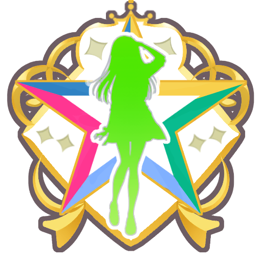

# Achievement
## Table of contents
* [Idol](#Idol)
* [Produce](#Produce)
* [Other](#Other)
## Idol

### アドレナリン全開: 【Yellow Big Bang！】藤田 ことねのプロデュースで最終試験に合格
* Rewards
  * Jewel × 20
   * Exp × 250

### Yellow Big Bang！: 【Yellow Big Bang！】藤田 ことねの特訓段階を3にする
* Rewards
  * Jewel × 20
   * Exp × 1000

### ちょー元気！: 【Yellow Big Bang！】藤田 ことねのプロデュースで評価A+以上を1回獲得
* Rewards
  * Jewel × 50
   * Exp × 1500

### 打倒お姉ちゃん: 【アイドル、はじめっ！】花海 佑芽のプロデュースで最終試験に合格
* Rewards
  * Jewel × 20
   * Exp × 250

### アイドル、はじめっ！: 【アイドル、はじめっ！】花海 佑芽の特訓段階を3にする
* Rewards
  * Jewel × 20
   * Exp × 1000

### 常勝不敗のトップアイドル: 【アイドル、はじめっ！】花海 佑芽のプロデュースで評価A+以上を1回獲得
* Rewards
  * Jewel × 50
   * Exp × 1500

### おっきなおにぎり: 【The Rolling Riceball】花海 佑芽のプロデュースで最終試験に合格
* Rewards
  * Jewel × 20
   * Exp × 250

### The Rolling Riceball: 【The Rolling Riceball】花海 佑芽の特訓段階を3にする
* Rewards
  * Jewel × 20
   * Exp × 1000

### 全校生徒への挑戦状: 【The Rolling Riceball】花海 佑芽のプロデュースで評価A+以上を1回獲得
* Rewards
  * Jewel × 50
   * Exp × 1500

### 絡まる想い: 【アイヴイ】月村 手毬のプロデュースで最終試験に合格
* Rewards
  * Jewel × 20
   * Exp × 250

### アイヴイ: 【アイヴイ】月村 手毬の特訓段階を3にする
* Rewards
  * Jewel × 20
   * Exp × 1000

### カッコいいアイドル: 【アイヴイ】月村 手毬のプロデュースで評価A+以上を1回獲得
* Rewards
  * Jewel × 50
   * Exp × 1500

### マスターアチーブメント: 有村 麻央のアチーブメントの★を10個獲得
* Rewards
  * Jewel × 100

### マスターアチーブメント: 藤田 ことねのアチーブメントの★を10個獲得
* Rewards
  * Jewel × 100

### マスターアチーブメント: 姫崎 莉波のアチーブメントの★を10個獲得
* Rewards
  * Jewel × 100

### マスターアチーブメント: 花海 咲季のアチーブメントの★を10個獲得
* Rewards
  * Jewel × 100

### マスターアチーブメント: 花海 佑芽のアチーブメントの★を10個獲得
* Rewards
  * Jewel × 100

### マスターアチーブメント: 倉本 千奈のアチーブメントの★を10個獲得
* Rewards
  * Jewel × 100

### マスターアチーブメント: 葛城 リーリヤのアチーブメントの★を10個獲得
* Rewards
  * Jewel × 100

### マスターアチーブメント: 篠澤 広のアチーブメントの★を10個獲得
* Rewards
  * Jewel × 100

### マスターアチーブメント: 紫雲 清夏のアチーブメントの★を10個獲得
* Rewards
  * Jewel × 100

### マスターアチーブメント: 月村 手毬のアチーブメントの★を10個獲得
* Rewards
  * Jewel × 100

### 本当のボク: 有村 麻央でTrue Endをみる
* Rewards
  * Exp × 1300
   * サポート強化Pt × 900
   * Jewel × 50

### カッコよさだけじゃない: 有村 麻央のプロデュースでスキルカードを250回使用
* Rewards
  * Exp × 300
   * サポート強化Pt × 500
   * Jewel × 20

### 道場仕込みの運動神経: 有村 麻央でレッスンを10回クリア
* Rewards
  * Exp × 300
   * サポート強化Pt × 400
   * Jewel × 20

### ハイブリッド: 有村 麻央でSPレッスンを15回クリア
* Rewards
  * Exp × 300
   * サポート強化Pt × 500
   * Jewel × 20

### 本当の魅力: 有村 麻央で最終試験に合格して評価B以上を1回獲得
* Rewards
  * Exp × 400
   * サポート強化Pt × 600
   * Jewel × 20

### 見せたい姿: 有村 麻央で最終試験に合格して評価A以上を1回獲得
* Rewards
  * Exp × 700
   * サポート強化Pt × 700
   * Jewel × 20

### ボクらしさ: 有村 麻央で最終試験に合格して評価S以上を1回獲得
* Rewards
  * Exp × 1300
   * サポート強化Pt × 900
   * Jewel × 30

### 諦めきれない夢: 有村 麻央のプロデュースを1回完了
* Rewards
  * Exp × 250
   * サポート強化Pt × 400
   * Jewel × 20

### 理想と現実: 有村 麻央の特訓段階を1にする
* Rewards
  * Exp × 300
   * サポート強化Pt × 400
   * Jewel × 20

### まだ見ぬ境地: 有村 麻央のプロデュースで最終試験に5回合格
* Rewards
  * Exp × 300
   * サポート強化Pt × 500
   * Jewel × 20

### リトルプリンス: 有村 麻央のファンを70000人獲得
* Rewards
  * Exp × 400
   * サポート強化Pt × 600
   * Jewel × 20

### キミのおかげです: 有村 麻央の親愛度Lvを9にする
* Rewards
  * Exp × 400
   * サポート強化Pt × 600
   * Jewel × 20

### 爽やかドリンク: 有村 麻央でPドリンクを30回使用
* Rewards
  * Exp × 300
   * サポート強化Pt × 500
   * Jewel × 20

### 護身術の達人: 有村 麻央のプロデュースで体力を合計500消費
* Rewards
  * Exp × 300
   * サポート強化Pt × 500
   * Jewel × 20

### 可愛さとカッコよさ: 有村 麻央のビジュアルを1000以上に育成してプロデュースを完了
* Rewards
  * Exp × 300
   * サポート強化Pt × 400
   * Jewel × 30

### らしさ: 【はじまりはカッコよく】有村 麻央のプロデュースで最終試験に合格
* Rewards
  * Jewel × 20
   * Exp × 250

### はじまりはカッコよく: 【はじまりはカッコよく】有村 麻央の特訓段階を3にする
* Rewards
  * Jewel × 20
   * Exp × 1000

### キミのおかげで、ボクは――: 【はじまりはカッコよく】有村 麻央のプロデュースで評価A+以上を1回獲得
* Rewards
  * Jewel × 50
   * Exp × 1500

### 盛装の華形: 【Fluorite】有村 麻央のプロデュースで最終試験に合格
* Rewards
  * Jewel × 20
   * Exp × 250

### Fluorite: 【Fluorite】有村 麻央の特訓段階を3にする
* Rewards
  * Jewel × 20
   * Exp × 1000

### めいっぱい輝いてみせますよ！: 【Fluorite】有村 麻央のプロデュースで評価A+以上を1回獲得
* Rewards
  * Jewel × 50
   * Exp × 1500

### Colorful Cute!: 【カワイイ♡はじめました】藤田 ことねのプロデュースで最終試験に合格
* Rewards
  * Jewel × 20
   * Exp × 250

### カワイイ♡はじめました: 【カワイイ♡はじめました】藤田 ことねの特訓段階を3にする
* Rewards
  * Jewel × 20
   * Exp × 1000

### すぐそばで見ていてくださいね！: 【カワイイ♡はじめました】藤田 ことねのプロデュースで評価A+以上を1回獲得
* Rewards
  * Jewel × 50
   * Exp × 1500

### よそ見はダメ♪: 【世界一可愛い私】藤田 ことねのプロデュースで最終試験に合格
* Rewards
  * Jewel × 20
   * Exp × 250

### 世界一可愛い私: 【世界一可愛い私】藤田 ことねの特訓段階を3にする
* Rewards
  * Jewel × 20
   * Exp × 1000

### ぜんぶぜんぶ可愛いんだぞ！: 【世界一可愛い私】藤田 ことねのプロデュースで評価A+以上を1回獲得
* Rewards
  * Jewel × 50
   * Exp × 1500

### 寄り添う気持ち: 【『私らしさ』のはじまり】姫崎 莉波のプロデュースで最終試験に合格
* Rewards
  * Jewel × 20
   * Exp × 250

### 『私らしさ』のはじまり: 【『私らしさ』のはじまり】姫崎 莉波の特訓段階を3にする
* Rewards
  * Jewel × 20
   * Exp × 1000

### 私はきみの、お姉ちゃん: 【『私らしさ』のはじまり】姫崎 莉波のプロデュースで評価A+以上を1回獲得
* Rewards
  * Jewel × 50
   * Exp × 1500

### 距離感: 【clumsy trick】姫崎 莉波のプロデュースで最終試験に合格
* Rewards
  * Jewel × 20
   * Exp × 250

### clumsy trick: 【clumsy trick】姫崎 莉波の特訓段階を3にする
* Rewards
  * Jewel × 20
   * Exp × 1000

### 私の素直な気持ち: 【clumsy trick】姫崎 莉波のプロデュースで評価A+以上を1回獲得
* Rewards
  * Jewel × 50
   * Exp × 1500

### 一番は譲らない: 【わたしが一番！】花海 咲季のプロデュースで最終試験に合格
* Rewards
  * Jewel × 20
   * Exp × 250

### わたしが一番！: 【わたしが一番！】花海 咲季の特訓段階を3にする
* Rewards
  * Jewel × 20
   * Exp × 1000

### 最後まで付き合いなさいよねっ！: 【わたしが一番！】花海 咲季のプロデュースで評価A+以上を1回獲得
* Rewards
  * Jewel × 50
   * Exp × 1500

### 絶対に負けない: 【Fighting My Way】花海 咲季のプロデュースで最終試験に合格
* Rewards
  * Jewel × 20
   * Exp × 250

### Fighting My Way: 【Fighting My Way】花海 咲季の特訓段階を3にする
* Rewards
  * Jewel × 20
   * Exp × 1000

### 不屈と勝利を歌ってくるわ！: 【Fighting My Way】花海 咲季のプロデュースで評価A+以上を1回獲得
* Rewards
  * Jewel × 50
   * Exp × 1500

### いっしょけんめい: 【胸を張って一歩ずつ】倉本 千奈のプロデュースで最終試験に合格
* Rewards
  * Jewel × 20
   * Exp × 250

### 胸を張って一歩ずつ: 【胸を張って一歩ずつ】倉本 千奈の特訓段階を3にする
* Rewards
  * Jewel × 20
   * Exp × 1000

### 先生と一緒なのですものっ！: 【胸を張って一歩ずつ】倉本 千奈のプロデュースで評価A+以上を1回獲得
* Rewards
  * Jewel × 50
   * Exp × 1500

### お嬢様の晴れ舞台: 【Wonder Scale】倉本 千奈のプロデュースで最終試験に合格
* Rewards
  * Jewel × 20
   * Exp × 250

### Wonder Scale: 【Wonder Scale】倉本 千奈の特訓段階を3にする
* Rewards
  * Jewel × 20
   * Exp × 1000

### ひだまりのようなライブを: 【Wonder Scale】倉本 千奈のプロデュースで評価A+以上を1回獲得
* Rewards
  * Jewel × 50
   * Exp × 1500

### 純白の妖精: 【一つ踏み出した先に】葛城 リーリヤのプロデュースで最終試験に合格
* Rewards
  * Jewel × 20
   * Exp × 250

### 一つ踏み出した先に: 【一つ踏み出した先に】葛城 リーリヤの特訓段階を3にする
* Rewards
  * Jewel × 20
   * Exp × 1000

### トップアイドルになります！: 【一つ踏み出した先に】葛城 リーリヤのプロデュースで評価A+以上を1回獲得
* Rewards
  * Jewel × 50
   * Exp × 1500

### もう怖くないから: 【白線】葛城 リーリヤのプロデュースで最終試験に合格
* Rewards
  * Jewel × 20
   * Exp × 250

### 白線: 【白線】葛城 リーリヤの特訓段階を3にする
* Rewards
  * Jewel × 20
   * Exp × 1000

### この曲みたいに空を飛べるように: 【白線】葛城 リーリヤのプロデュースで評価A+以上を1回獲得
* Rewards
  * Jewel × 50
   * Exp × 1500

### 苦しいのが好き: 【一番向いてないこと】篠澤 広のプロデュースで最終試験に合格
* Rewards
  * Jewel × 20
   * Exp × 250

### 一番向いてないこと: 【一番向いてないこと】篠澤 広の特訓段階を3にする
* Rewards
  * Jewel × 20
   * Exp × 1000

### それなら、ずっと、楽しいね: 【一番向いてないこと】篠澤 広のプロデュースで評価A+以上を1回獲得
* Rewards
  * Jewel × 50
   * Exp × 1500

### 本気の趣味: 【光景】篠澤 広のプロデュースで最終試験に合格
* Rewards
  * Jewel × 20
   * Exp × 250

### 光景: 【光景】篠澤 広の特訓段階を3にする
* Rewards
  * Jewel × 20
   * Exp × 1000

### わたしとみんながわくわくする歌: 【光景】篠澤 広のプロデュースで評価A+以上を1回獲得
* Rewards
  * Jewel × 50
   * Exp × 1500

### 勇気の一歩: 【夢へのリスタート】紫雲 清夏のプロデュースで最終試験に合格
* Rewards
  * Jewel × 20
   * Exp × 250

### 夢へのリスタート: 【夢へのリスタート】紫雲 清夏の特訓段階を3にする
* Rewards
  * Jewel × 20
   * Exp × 1000

### 裏切ったら恨むからね？: 【夢へのリスタート】紫雲 清夏のプロデュースで評価A+以上を1回獲得
* Rewards
  * Jewel × 50
   * Exp × 1500

### ワンモアステップ: 【Tame-Lie-One-Step】紫雲 清夏のプロデュースで最終試験に合格
* Rewards
  * Jewel × 20
   * Exp × 250

### Tame-Lie-One-Step: 【Tame-Lie-One-Step】紫雲 清夏の特訓段階を3にする
* Rewards
  * Jewel × 20
   * Exp × 1000

### ためらいがあっても、もう一歩: 【Tame-Lie-One-Step】紫雲 清夏のプロデュースで評価A+以上を1回獲得
* Rewards
  * Jewel × 50
   * Exp × 1500

### ローン・ウルフ: 【一匹狼】月村 手毬のプロデュースで最終試験に合格
* Rewards
  * Jewel × 20
   * Exp × 250

### 一匹狼: 【一匹狼】月村 手毬の特訓段階を3にする
* Rewards
  * Jewel × 20
   * Exp × 1000

### 一番高いところまで、連れていく: 【一匹狼】月村 手毬のプロデュースで評価A+以上を1回獲得
* Rewards
  * Jewel × 50
   * Exp × 1500

### それぞれの道: 【Luna say maybe】月村 手毬のプロデュースで最終試験に合格
* Rewards
  * Jewel × 20
   * Exp × 250

### Luna say maybe: 【Luna say maybe】月村 手毬の特訓段階を3にする
* Rewards
  * Jewel × 20
   * Exp × 1000

### 素直になれない、ひねくれ者の歌: 【Luna say maybe】月村 手毬のプロデュースで評価A+以上を1回獲得
* Rewards
  * Jewel × 50
   * Exp × 1500

### アイドルになったんだ: 藤田 ことねでTrue Endをみる
* Rewards
  * Exp × 1300
   * サポート強化Pt × 900
   * Jewel × 50

### QOL: 藤田 ことねのプロデュースでスキルカードを250回使用
* Rewards
  * Exp × 300
   * サポート強化Pt × 500
   * Jewel × 20

### イチバンかわいい: 藤田 ことねでレッスンを10回クリア
* Rewards
  * Exp × 300
   * サポート強化Pt × 400
   * Jewel × 20

### 世界一かわいい: 藤田 ことねでSPレッスンを15回クリア
* Rewards
  * Exp × 300
   * サポート強化Pt × 500
   * Jewel × 20

### 仕事は仕事: 藤田 ことねで最終試験に合格して評価B以上を1回獲得
* Rewards
  * Exp × 400
   * サポート強化Pt × 600
   * Jewel × 20

### つまづいてなんていられない: 藤田 ことねで最終試験に合格して評価A以上を1回獲得
* Rewards
  * Exp × 700
   * サポート強化Pt × 700
   * Jewel × 20

### 成り上がりはここから: 藤田 ことねで最終試験に合格して評価S以上を1回獲得
* Rewards
  * Exp × 1300
   * サポート強化Pt × 900
   * Jewel × 30

### 成り上がれ！: 藤田 ことねのプロデュースを1回完了
* Rewards
  * Exp × 250
   * サポート強化Pt × 400
   * Jewel × 20

### 秘めた才能: 藤田 ことねの特訓段階を1にする
* Rewards
  * Exp × 300
   * サポート強化Pt × 400
   * Jewel × 20

### もっと褒めてぇ～♡: 藤田 ことねのプロデュースで最終試験に5回合格
* Rewards
  * Exp × 300
   * サポート強化Pt × 500
   * Jewel × 20

### 初星学園の看板娘: 藤田 ことねのファンを70000人獲得
* Rewards
  * Exp × 400
   * サポート強化Pt × 600
   * Jewel × 20

### ぷろでゅ～さぁ～♡: 藤田 ことねの親愛度Lvを9にする
* Rewards
  * Exp × 400
   * サポート強化Pt × 600
   * Jewel × 20

### アイドル適正S: 藤田 ことねでプロデュース評価を合計50000獲得
* Rewards
  * Exp × 300
   * サポート強化Pt × 500
   * Jewel × 20

### やりくり上手: 藤田 ことねのプロデュースの相談で15回交換
* Rewards
  * Exp × 300
   * サポート強化Pt × 500
   * Jewel × 20

### 軽快ステップ: 藤田 ことねのダンスを1000以上に育成してプロデュースを完了
* Rewards
  * Exp × 300
   * サポート強化Pt × 400
   * Jewel × 30

### 本当のきもち: 姫崎 莉波でTrue Endをみる
* Rewards
  * Exp × 1300
   * サポート強化Pt × 900
   * Jewel × 50

### 理想の姉へ: 姫崎 莉波のプロデュースでスキルカードを250回使用
* Rewards
  * Exp × 300
   * サポート強化Pt × 500
   * Jewel × 20

### ほのかな芽生え: 姫崎 莉波でレッスンを10回クリア
* Rewards
  * Exp × 300
   * サポート強化Pt × 400
   * Jewel × 20

### あふれだす想い: 姫崎 莉波でSPレッスンを15回クリア
* Rewards
  * Exp × 300
   * サポート強化Pt × 500
   * Jewel × 20

### あの頃に戻ったみたい: 姫崎 莉波で最終試験に合格して評価B以上を1回獲得
* Rewards
  * Exp × 400
   * サポート強化Pt × 600
   * Jewel × 20

### きみの好きな私: 姫崎 莉波で最終試験に合格して評価A以上を1回獲得
* Rewards
  * Exp × 700
   * サポート強化Pt × 700
   * Jewel × 20

### お姉さんスイッチ: 姫崎 莉波で最終試験に合格して評価S以上を1回獲得
* Rewards
  * Exp × 1300
   * サポート強化Pt × 900
   * Jewel × 30

### 今度こそリスタート: 姫崎 莉波のプロデュースを1回完了
* Rewards
  * Exp × 250
   * サポート強化Pt × 400
   * Jewel × 20

### きみの気持ちに応えたい: 姫崎 莉波の特訓段階を1にする
* Rewards
  * Exp × 300
   * サポート強化Pt × 400
   * Jewel × 20

### お姉さんとの約束だよ: 姫崎 莉波のプロデュースで最終試験に5回合格
* Rewards
  * Exp × 300
   * サポート強化Pt × 500
   * Jewel × 20

### お姉さんの包容力: 姫崎 莉波のファンを70000人獲得
* Rewards
  * Exp × 400
   * サポート強化Pt × 600
   * Jewel × 20

### 私はきみの……: 姫崎 莉波の親愛度Lvを9にする
* Rewards
  * Exp × 400
   * サポート強化Pt × 600
   * Jewel × 20

### 心に潤いを: 姫崎 莉波でPドリンクを30回使用
* Rewards
  * Exp × 300
   * サポート強化Pt × 500
   * Jewel × 20

### 真面目にこつこつ: 姫崎 莉波のプロデュースで体力を合計500消費
* Rewards
  * Exp × 300
   * サポート強化Pt × 500
   * Jewel × 20

### 優しい笑顔: 姫崎 莉波のビジュアルを1000以上に育成してプロデュースを完了
* Rewards
  * Exp × 300
   * サポート強化Pt × 400
   * Jewel × 30

### 無敵のトップアイドル: 花海 咲季でTrue Endをみる
* Rewards
  * Exp × 1300
   * サポート強化Pt × 900
   * Jewel × 50

### もう逃げない: 花海 咲季のプロデュースでスキルカードを250回使用
* Rewards
  * Exp × 300
   * サポート強化Pt × 500
   * Jewel × 20

### 入学試験首席の力よ！: 花海 咲季でレッスンを10回クリア
* Rewards
  * Exp × 300
   * サポート強化Pt × 400
   * Jewel × 20

### 早熟の天才: 花海 咲季でSPレッスンを15回クリア
* Rewards
  * Exp × 300
   * サポート強化Pt × 500
   * Jewel × 20

### 不屈のアイドル: 花海 咲季で最終試験に合格して評価B以上を1回獲得
* Rewards
  * Exp × 400
   * サポート強化Pt × 600
   * Jewel × 20

### 最高のお姉ちゃん: 花海 咲季で最終試験に合格して評価A以上を1回獲得
* Rewards
  * Exp × 700
   * サポート強化Pt × 700
   * Jewel × 20

### 一世一代の悪あがき: 花海 咲季で最終試験に合格して評価S以上を1回獲得
* Rewards
  * Exp × 1300
   * サポート強化Pt × 900
   * Jewel × 30

### 妹への挑戦: 花海 咲季のプロデュースを1回完了
* Rewards
  * Exp × 250
   * サポート強化Pt × 400
   * Jewel × 20

### 限界はまだ: 花海 咲季の特訓段階を1にする
* Rewards
  * Exp × 300
   * サポート強化Pt × 400
   * Jewel × 20

### 合格は当たり前: 花海 咲季のプロデュースで最終試験に5回合格
* Rewards
  * Exp × 300
   * サポート強化Pt × 500
   * Jewel × 20

### 小さなお姉ちゃん: 花海 咲季のファンを70000人獲得
* Rewards
  * Exp × 400
   * サポート強化Pt × 600
   * Jewel × 20

### 期待してるからっ！: 花海 咲季の親愛度Lvを9にする
* Rewards
  * Exp × 400
   * サポート強化Pt × 600
   * Jewel × 20

### トップまで止まらない: 花海 咲季でプロデュース評価を合計50000獲得
* Rewards
  * Exp × 300
   * サポート強化Pt × 500
   * Jewel × 20

### 無限の向上心: 花海 咲季のプロデュースでスキルカードを20回強化
* Rewards
  * Exp × 300
   * サポート強化Pt × 500
   * Jewel × 20

### オールラウンダー: 花海 咲季のビジュアルを900以上に育成してプロデュースを完了
* Rewards
  * Exp × 300
   * サポート強化Pt × 400
   * Jewel × 30

### 人生最高のファインプレー: 花海 佑芽でTrue Endをみる
* Rewards
  * Exp × 1300
   * サポート強化Pt × 900
   * Jewel × 50

### 姉への挑戦: 花海 佑芽のプロデュースでスキルカードを250回使用
* Rewards
  * Exp × 300
   * サポート強化Pt × 500
   * Jewel × 20

### 地道なトレーニング: 花海 佑芽でレッスンを10回クリア
* Rewards
  * Exp × 300
   * サポート強化Pt × 400
   * Jewel × 20

### 無限の体力: 花海 佑芽でSPレッスンを15回クリア
* Rewards
  * Exp × 300
   * サポート強化Pt × 500
   * Jewel × 20

### 気持ちだけは負けません: 花海 佑芽で最終試験に合格して評価B以上を1回獲得
* Rewards
  * Exp × 400
   * サポート強化Pt × 600
   * Jewel × 20

### 次こそ絶対！: 花海 佑芽で最終試験に合格して評価A以上を1回獲得
* Rewards
  * Exp × 700
   * サポート強化Pt × 700
   * Jewel × 20

### 今日より強いあたし: 花海 佑芽で最終試験に合格して評価S以上を1回獲得
* Rewards
  * Exp × 1300
   * サポート強化Pt × 900
   * Jewel × 30

### 考える前に動け: 花海 佑芽のプロデュースを1回完了
* Rewards
  * Exp × 250
   * サポート強化Pt × 400
   * Jewel × 20

### 加速度的成長: 花海 佑芽の特訓段階を1にする
* Rewards
  * Exp × 300
   * サポート強化Pt × 400
   * Jewel × 20

### 輝く原石: 花海 佑芽のプロデュースで最終試験に5回合格
* Rewards
  * Exp × 300
   * サポート強化Pt × 500
   * Jewel × 20

### 王道アイドル: 花海 佑芽のファンを70000人獲得
* Rewards
  * Exp × 400
   * サポート強化Pt × 600
   * Jewel × 20

### プロデューサーさんっ！: 花海 佑芽の親愛度Lvを9にする
* Rewards
  * Exp × 400
   * サポート強化Pt × 600
   * Jewel × 20

### たくさんほしいです！: 花海 佑芽でPドリンクを30回使用
* Rewards
  * Exp × 300
   * サポート強化Pt × 500
   * Jewel × 20

### 溢れ出る元気: 花海 佑芽のプロデュースで元気を合計1000獲得
* Rewards
  * Exp × 300
   * サポート強化Pt × 500
   * Jewel × 20

### 着実な進歩: 花海 佑芽のダンスを1000以上に育成してプロデュースを完了
* Rewards
  * Exp × 300
   * サポート強化Pt × 400
   * Jewel × 30

### レベル1の駆け出しアイドル: 倉本 千奈でTrue Endをみる
* Rewards
  * Exp × 1300
   * サポート強化Pt × 900
   * Jewel × 50

### 練習、練習、また練習: 倉本 千奈のプロデュースでスキルカードを250回使用
* Rewards
  * Exp × 300
   * サポート強化Pt × 500
   * Jewel × 20

### スタートライン: 倉本 千奈でレッスンを10回クリア
* Rewards
  * Exp × 300
   * サポート強化Pt × 400
   * Jewel × 20

### 元気一点突破: 倉本 千奈でSPレッスンを15回クリア
* Rewards
  * Exp × 300
   * サポート強化Pt × 500
   * Jewel × 20

### ぶっちぎりで最下位ですわ！: 倉本 千奈で最終試験に合格して評価B以上を1回獲得
* Rewards
  * Exp × 400
   * サポート強化Pt × 600
   * Jewel × 20

### お爺様への反逆: 倉本 千奈で最終試験に合格して評価A以上を1回獲得
* Rewards
  * Exp × 700
   * サポート強化Pt × 700
   * Jewel × 20

### 立派なアイドルに！: 倉本 千奈で最終試験に合格して評価S以上を1回獲得
* Rewards
  * Exp × 1300
   * サポート強化Pt × 900
   * Jewel × 30

### 落ちこぼれからの挑戦: 倉本 千奈のプロデュースを1回完了
* Rewards
  * Exp × 250
   * サポート強化Pt × 400
   * Jewel × 20

### 一歩一歩成長中！: 倉本 千奈の特訓段階を1にする
* Rewards
  * Exp × 300
   * サポート強化Pt × 400
   * Jewel × 20

### 落ちこぼれとは言わせない: 倉本 千奈のプロデュースで最終試験に5回合格
* Rewards
  * Exp × 300
   * サポート強化Pt × 500
   * Jewel × 20

### 愛されアイドル: 倉本 千奈のファンを70000人獲得
* Rewards
  * Exp × 400
   * サポート強化Pt × 600
   * Jewel × 20

### 先生っ！！: 倉本 千奈の親愛度Lvを9にする
* Rewards
  * Exp × 400
   * サポート強化Pt × 600
   * Jewel × 20

### 天真爛漫: 倉本 千奈のプロデュースで元気を合計1000獲得
* Rewards
  * Exp × 300
   * サポート強化Pt × 500
   * Jewel × 20

### 財力: 倉本 千奈のプロデュースの相談で15回交換
* Rewards
  * Exp × 300
   * サポート強化Pt × 500
   * Jewel × 20

### ダメダメだって頑張ってる: 倉本 千奈のダンスを1000以上に育成してプロデュースを完了
* Rewards
  * Exp × 300
   * サポート強化Pt × 400
   * Jewel × 30

### 光: 葛城 リーリヤでTrue Endをみる
* Rewards
  * Exp × 1300
   * サポート強化Pt × 900
   * Jewel × 50

### 笑顔の練習: 葛城 リーリヤのプロデュースでスキルカードを250回使用
* Rewards
  * Exp × 300
   * サポート強化Pt × 500
   * Jewel × 20

### 基本の『き』から: 葛城 リーリヤでレッスンを10回クリア
* Rewards
  * Exp × 300
   * サポート強化Pt × 400
   * Jewel × 20

### ビシバシやります: 葛城 リーリヤでSPレッスンを15回クリア
* Rewards
  * Exp × 300
   * サポート強化Pt × 500
   * Jewel × 20

### みんなの前で歌いたい: 葛城 リーリヤで最終試験に合格して評価B以上を1回獲得
* Rewards
  * Exp × 400
   * サポート強化Pt × 600
   * Jewel × 20

### アイドルになります: 葛城 リーリヤで最終試験に合格して評価A以上を1回獲得
* Rewards
  * Exp × 700
   * サポート強化Pt × 700
   * Jewel × 20

### 羽ばたいたリーリヤ: 葛城 リーリヤで最終試験に合格して評価S以上を1回獲得
* Rewards
  * Exp × 1300
   * サポート強化Pt × 900
   * Jewel × 30

### 勇気を出して: 葛城 リーリヤのプロデュースを1回完了
* Rewards
  * Exp × 250
   * サポート強化Pt × 400
   * Jewel × 20

### 歩くような速さだとしても: 葛城 リーリヤの特訓段階を1にする
* Rewards
  * Exp × 300
   * サポート強化Pt × 400
   * Jewel × 20

### 走り続けたその先: 葛城 リーリヤのプロデュースで最終試験に5回合格
* Rewards
  * Exp × 300
   * サポート強化Pt × 500
   * Jewel × 20

### 真っ直ぐな眼差し: 葛城 リーリヤのファンを70000人獲得
* Rewards
  * Exp × 400
   * サポート強化Pt × 600
   * Jewel × 20

### センパイと一緒なら……: 葛城 リーリヤの親愛度Lvを9にする
* Rewards
  * Exp × 400
   * サポート強化Pt × 600
   * Jewel × 20

### 大きく声を出して: 葛城 リーリヤのプロデュースで元気を合計1000獲得
* Rewards
  * Exp × 300
   * サポート強化Pt × 500
   * Jewel × 20

### 踏み出す勇気: 葛城 リーリヤのプロデュースでスキルカードを20回強化
* Rewards
  * Exp × 300
   * サポート強化Pt × 500
   * Jewel × 20

### 楽しませる喜び: 葛城 リーリヤのビジュアルを1000以上に育成してプロデュースを完了
* Rewards
  * Exp × 300
   * サポート強化Pt × 400
   * Jewel × 30

### ずっと、楽しいね: 篠澤 広でTrue Endをみる
* Rewards
  * Exp × 1300
   * サポート強化Pt × 900
   * Jewel × 50

### 課題達成: 篠澤 広のプロデュースでスキルカードを250回使用
* Rewards
  * Exp × 300
   * サポート強化Pt × 500
   * Jewel × 20

### 倒れなかった回数: 篠澤 広でレッスンを10回クリア
* Rewards
  * Exp × 300
   * サポート強化Pt × 400
   * Jewel × 20

### 辛いほどいい: 篠澤 広でSPレッスンを15回クリア
* Rewards
  * Exp × 300
   * サポート強化Pt × 500
   * Jewel × 20

### 一番向いていない仕事: 篠澤 広で最終試験に合格して評価B以上を1回獲得
* Rewards
  * Exp × 400
   * サポート強化Pt × 600
   * Jewel × 20

### 悔しいかもしれない: 篠澤 広で最終試験に合格して評価A以上を1回獲得
* Rewards
  * Exp × 700
   * サポート強化Pt × 700
   * Jewel × 20

### 本契約: 篠澤 広で最終試験に合格して評価S以上を1回獲得
* Rewards
  * Exp × 1300
   * サポート強化Pt × 900
   * Jewel × 30

### 茨の道: 篠澤 広のプロデュースを1回完了
* Rewards
  * Exp × 250
   * サポート強化Pt × 400
   * Jewel × 20

### 次の課題はなに？: 篠澤 広の特訓段階を1にする
* Rewards
  * Exp × 300
   * サポート強化Pt × 400
   * Jewel × 20

### あたってくだけろ: 篠澤 広のプロデュースで最終試験に5回合格
* Rewards
  * Exp × 300
   * サポート強化Pt × 500
   * Jewel × 20

### 放っておけない: 篠澤 広のファンを70000人獲得
* Rewards
  * Exp × 400
   * サポート強化Pt × 600
   * Jewel × 20

### まだ見捨てない？: 篠澤 広の親愛度Lvを9にする
* Rewards
  * Exp × 400
   * サポート強化Pt × 600
   * Jewel × 20

### 才能なしでもやれること: 篠澤 広でプロデュース評価を合計50000獲得
* Rewards
  * Exp × 300
   * サポート強化Pt × 500
   * Jewel × 20

### 苦難こそ喜び: 篠澤 広のプロデュースで元気を合計1000獲得
* Rewards
  * Exp × 300
   * サポート強化Pt × 500
   * Jewel × 20

### ミステリアスガール: 篠澤 広のボーカルを1000以上に育成してプロデュースを完了
* Rewards
  * Exp × 300
   * サポート強化Pt × 400
   * Jewel × 30

### 踏み出した一歩: 紫雲 清夏でTrue Endをみる
* Rewards
  * Exp × 1300
   * サポート強化Pt × 900
   * Jewel × 50

### まずは遊びから: 紫雲 清夏のプロデュースでスキルカードを250回使用
* Rewards
  * Exp × 300
   * サポート強化Pt × 500
   * Jewel × 20

### センスは抜群: 紫雲 清夏でレッスンを10回クリア
* Rewards
  * Exp × 300
   * サポート強化Pt × 400
   * Jewel × 20

### 前を向いて: 紫雲 清夏でSPレッスンを15回クリア
* Rewards
  * Exp × 300
   * サポート強化Pt × 500
   * Jewel × 20

### そこまで言うならやってあげる！: 紫雲 清夏で最終試験に合格して評価B以上を1回獲得
* Rewards
  * Exp × 400
   * サポート強化Pt × 600
   * Jewel × 20

### その嘘が本当になるまで: 紫雲 清夏で最終試験に合格して評価A以上を1回獲得
* Rewards
  * Exp × 700
   * サポート強化Pt × 700
   * Jewel × 20

### ケジメとキズナと: 紫雲 清夏で最終試験に合格して評価S以上を1回獲得
* Rewards
  * Exp × 1300
   * サポート強化Pt × 900
   * Jewel × 30

### 諦められない: 紫雲 清夏のプロデュースを1回完了
* Rewards
  * Exp × 250
   * サポート強化Pt × 400
   * Jewel × 20

### 明けない夜を終わらせて: 紫雲 清夏の特訓段階を1にする
* Rewards
  * Exp × 300
   * サポート強化Pt × 400
   * Jewel × 20

### 本気を出せば: 紫雲 清夏のプロデュースで最終試験に5回合格
* Rewards
  * Exp × 300
   * サポート強化Pt × 500
   * Jewel × 20

### トモダチ: 紫雲 清夏のファンを70000人獲得
* Rewards
  * Exp × 400
   * サポート強化Pt × 600
   * Jewel × 20

### ありがと、Pっち: 紫雲 清夏の親愛度Lvを9にする
* Rewards
  * Exp × 400
   * サポート強化Pt × 600
   * Jewel × 20

### 流行りはバッチリ: 紫雲 清夏でPドリンクを30回使用
* Rewards
  * Exp × 300
   * サポート強化Pt × 500
   * Jewel × 20

### 調子いいかも♪: 紫雲 清夏のプロデュースで体力を合計500消費
* Rewards
  * Exp × 300
   * サポート強化Pt × 500
   * Jewel × 20

### 未来へのステップ: 紫雲 清夏のダンスを1000以上に育成してプロデュースを完了
* Rewards
  * Exp × 300
   * サポート強化Pt × 400
   * Jewel × 30

### 私だけのプロデューサー: 月村 手毬でTrue Endをみる
* Rewards
  * Exp × 1300
   * サポート強化Pt × 900
   * Jewel × 50

### 体質改善: 月村 手毬のプロデュースでスキルカードを250回使用
* Rewards
  * Exp × 300
   * サポート強化Pt × 500
   * Jewel × 20

### ストイック: 月村 手毬でレッスンを10回クリア
* Rewards
  * Exp × 300
   * サポート強化Pt × 400
   * Jewel × 20

### ワンマンシンガー: 月村 手毬でSPレッスンを15回クリア
* Rewards
  * Exp × 300
   * サポート強化Pt × 500
   * Jewel × 20

### 失望させないで: 月村 手毬で最終試験に合格して評価B以上を1回獲得
* Rewards
  * Exp × 400
   * サポート強化Pt × 600
   * Jewel × 20

### 2人の秘密: 月村 手毬で最終試験に合格して評価A以上を1回獲得
* Rewards
  * Exp × 700
   * サポート強化Pt × 700
   * Jewel × 20

### 一番高いところまで: 月村 手毬で最終試験に合格して評価S以上を1回獲得
* Rewards
  * Exp × 1300
   * サポート強化Pt × 900
   * Jewel × 30

### 意地とプライド: 月村 手毬のプロデュースを1回完了
* Rewards
  * Exp × 250
   * サポート強化Pt × 400
   * Jewel × 20

### どこまでも高く: 月村 手毬の特訓段階を1にする
* Rewards
  * Exp × 300
   * サポート強化Pt × 400
   * Jewel × 20

### 当然です: 月村 手毬のプロデュースで最終試験に5回合格
* Rewards
  * Exp × 300
   * サポート強化Pt × 500
   * Jewel × 20

### 孤高の負けず嫌い: 月村 手毬のファンを70000人獲得
* Rewards
  * Exp × 400
   * サポート強化Pt × 600
   * Jewel × 20

### そんなに私がいいんだ？: 月村 手毬の親愛度Lvを9にする
* Rewards
  * Exp × 400
   * サポート強化Pt × 600
   * Jewel × 20

### 全身全霊: 月村 手毬のプロデュースでスキルカードを20回強化
* Rewards
  * Exp × 300
   * サポート強化Pt × 500
   * Jewel × 20

### 妥協はナシ: 月村 手毬のプロデュースの相談で15回交換
* Rewards
  * Exp × 300
   * サポート強化Pt × 500
   * Jewel × 20

### 歌姫: 月村 手毬のボーカルを1000以上に育成してプロデュースを完了
* Rewards
  * Exp × 300
   * サポート強化Pt × 400
   * Jewel × 30
## Produce
### 縁の下の力持ち: Pポイントを合計2000獲得
* Rewards
  * Exp × 100
   * Jewel × 50
   * サポート強化Pt × 200
### 思い出いっぱい: アチーブメントを70個獲得
* Rewards
  * Exp × 400
   * Jewel × 50
   * サポート強化Pt × 500
### テクニシャン: スキルカードを合計50獲得
* Rewards
  * Exp × 100
   * Jewel × 50
   * サポート強化Pt × 200
### サポート上手: Pアイテムを合計30獲得
* Rewards
  * Exp × 150
   * Jewel × 50
   * サポート強化Pt × 200
### 水分補給！: Pドリンクを合計50獲得
* Rewards
  * Exp × 150
   * Jewel × 50
   * サポート強化Pt × 200
### 準備万端: スキルカードを100種類獲得
* Rewards
  * Exp × 150
   * Jewel × 50
   * サポート強化Pt × 200
### 創意工夫: Pアイテムを20種類獲得
* Rewards
  * Exp × 400
   * Jewel × 50
   * サポート強化Pt × 500
### ドリンクマニア: Pドリンクを10種類獲得
* Rewards
  * Exp × 400
   * Jewel × 50
   * サポート強化Pt × 500
### ボーカルマスター: プロデュースでVoレッスンを30回選択
* Rewards
  * Exp × 150
   * Jewel × 50
   * サポート強化Pt × 200
### ダンスマスター: プロデュースでDaレッスンを30回選択
* Rewards
  * Exp × 150
   * Jewel × 50
   * サポート強化Pt × 200
### ビジュアルマスター: プロデュースでViレッスンを30回選択
* Rewards
  * Exp × 150
   * Jewel × 50
   * サポート強化Pt × 200
### 備えあれば憂いなし: プロデュースで活動支給を40回選択
* Rewards
  * Exp × 400
   * Jewel × 50
   * サポート強化Pt × 500
### 学園生活: プロデュースで授業/おでかけを50回選択
* Rewards
  * Exp × 400
   * Jewel × 50
   * サポート強化Pt × 500
### 指導上手: プロデュースでスキルカードを30回強化
* Rewards
  * Exp × 150
   * Jewel × 50
   * サポート強化Pt × 200
### 常連さん: 相談室で50回交換
* Rewards
  * Exp × 300
   * Jewel × 50
   * サポート強化Pt × 300
### 日々の鍛錬: レッスンを30回クリア
* Rewards
  * Exp × 100
   * Jewel × 50
   * サポート強化Pt × 200
### 気合を入れて: SPレッスンを30回クリア
* Rewards
  * Exp × 300
   * Jewel × 50
   * サポート強化Pt × 300
### 熱血指導: プロデュースで体力を合計500消費
* Rewards
  * Exp × 150
   * Jewel × 50
   * サポート強化Pt × 200
### 中級プロデューサー: 最終試験をスコアB以上で1回合格
* Rewards
  * Exp × 300
   * Jewel × 50
   * サポート強化Pt × 300
### 上級プロデューサー: 最終試験をスコアA以上で1回合格
* Rewards
  * Exp × 2950
   * Jewel × 50
   * サポート強化Pt × 1000
### ベテランプロデューサー: 最終試験をスコアA+以上で1回合格
* Rewards
  * Exp × 3250
   * Jewel × 50
   * サポート強化Pt × 1000
### 敏腕プロデューサー: 最終試験をスコアS以上で1回合格
* Rewards
  * Exp × 3700
   * Jewel × 100
   * サポート強化Pt × 1100
### つぼみから花へ: True Endを3人達成
* Rewards
  * Exp × 1250
   * Jewel × 50
   * サポート強化Pt × 900
### 積み重なる経験: プロデュースを3回完了
* Rewards
  * Exp × 100
   * Jewel × 50
   * サポート強化Pt × 200
## Other
### 初星学園へようこそ: プロデュースを始めた証
* Rewards
  * Jewel × 30
### がんばりや: お仕事を合計1000時間
* Rewards
  * Jewel × 50
### 単位取得: 課題を50個クリア
* Rewards
  * Jewel × 30
### 成績優秀: 課題を100個クリア
* Rewards
  * Jewel × 50
### ルーキー卒業: プロデューサーLv30に到達
* Rewards
  * Jewel × 50
### 道半ば: プロデューサーLv45に到達
* Rewards
  * Jewel × 50
### 打ち出の小槌: 活動費で合計2000000のマニーを受け取る
* Rewards
  * Jewel × 50
### 下積み: 合計ファン数を400000人にする
* Rewards
  * Jewel × 50
### 稼ぎ頭: 合計ファン数を2000000人にする
* Rewards
  * Jewel × 50
### ヒットメーカー: 合計ファン数を7000000人にする
* Rewards
  * Jewel × 100
### 幅広い人脈: フォロワー数500人以上
* Rewards
  * Jewel × 100
### コンテスト覇者: コンテストで1位以内に入る
* Rewards
  * Jewel × 50
### 一流: コンテストで100位以内に入る
* Rewards
  * Jewel × 50
### 夢への第一歩: コンテストでグレード1に到達
* Rewards
  * Jewel × 30
### 青二才の努力: コンテストでグレード2に到達
* Rewards
  * Jewel × 50
### 石の上にも三年: コンテストでグレード3に到達
* Rewards
  * Jewel × 50
### 四六時中アイドル: コンテストでグレード4に到達
* Rewards
  * Jewel × 50
### 五感を駆使して: コンテストでグレード5に到達
* Rewards
  * Jewel × 50
### 六芸に通ず: コンテストでグレード6に到達
* Rewards
  * Jewel × 50
### 七海に轟く: コンテストでグレード7に到達
* Rewards
  * Jewel × 50
### 期待の新人: コンテストでスコアを10000以上獲得
* Rewards
  * Jewel × 30
### ダークホース: コンテストでスコアを30000以上獲得
* Rewards
  * Jewel × 50
### 本命候補: コンテストでスコアを60000以上獲得
* Rewards
  * Jewel × 50