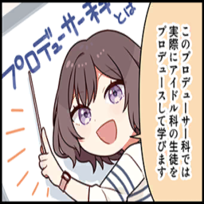
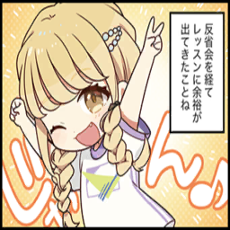

# Media
## Table of comtents
* [Comic](#Comic)
	* [お姉ちゃんだもの！](#お姉ちゃんだもの！)
	* [手作りのお味](#手作りのお味)
	* [相反する二人](#相反する二人)
	* [ちぐはぐ](#ちぐはぐ)
	* [寮長と攻防](#寮長と攻防)
	* [三者三様](#三者三様)
	* [毎日努力中](#毎日努力中)
	* [絵になる二人](#絵になる二人)
	* [可愛い後輩たち](#可愛い後輩たち)
	* [2人きりだから…♡](#2人きりだから…♡)
	* [これでもストレッチ中](#これでもストレッチ中)
	* [天才少女はナチュラルに](#天才少女はナチュラルに)
	* [どうしよう](#どうしよう)
	* [憧れの人](#憧れの人)
	* [ふたりはなかよし♪](#ふたりはなかよし♪)
	* [矢も盾もたまらず](#矢も盾もたまらず)
	* [あの日の約束](#あの日の約束)
	* [同志みつけたり](#同志みつけたり)
	* [元気いっぱい！](#元気いっぱい！)
	* [お世話したい](#お世話したい)
	* [カリスマ会長の内心は](#カリスマ会長の内心は)
* [Comic4](#Comic4)
	* [第1話-学マス4コマ始まります！](#第1話-学マス4コマ始まります！)
	* [第2話-追加プロフィール](#第2話-追加プロフィール)
	* [第3話-厳しさの裏では…](#第3話-厳しさの裏では…)
	* [第4話-多方面に忙しい](#第4話-多方面に忙しい)
	* [第5話-気が緩む瞬間](#第5話-気が緩む瞬間)
	* [第6話-初星学園は自由がいっぱい](#第6話-初星学園は自由がいっぱい)
	* [第7話-休日の過ごし方](#第7話-休日の過ごし方)
	* [第8話-わたしのこと](#第8話-わたしのこと)
	* [第9話-アイドル科のいいところ](#第9話-アイドル科のいいところ)
	* [第10話-頑張りすぎる君に](#第10話-頑張りすぎる君に)
	* [第11話-プロデューサー科とは](#第11話-プロデューサー科とは)
	* [第12話-倉本家の箱入り娘](#第12話-倉本家の箱入り娘)
	* [第13話-どっちがすごいの？](#第13話-どっちがすごいの？)
	* [第14話-いつでもどこでも](#第14話-いつでもどこでも)
	* [第15話-寮のあれこれ](#第15話-寮のあれこれ)
	* [第16話-学園施設へご案内♪](#第16話-学園施設へご案内♪)
	* [第17話-生徒会の日常](#第17話-生徒会の日常)
	* [第18話-あさり先生という人](#第18話-あさり先生という人)
	* [第19話-学園長ってどんな人？](#第19話-学園長ってどんな人？)
	* [第20話-略称はSSD](#第20話-略称はSSD)
	* [第21話-アイドル月村手毬](#第21話-アイドル月村手毬)
	* [第22話-れっつパーティ](#第22話-れっつパーティ)
	* [第23話-ライバルはお姉ちゃん](#第23話-ライバルはお姉ちゃん)
	* [第24話-レッスンの観客](#第24話-レッスンの観客)
	* [第25話-ピタッと共同生活](#第25話-ピタッと共同生活)
## Comic
### お姉ちゃんだもの！
* Character:
	* 花海 咲季
	* 花海 佑芽
* thumbnail: 

* content:

### 手作りのお味
* Character:
	* 倉本 千奈
	* 花海 咲季
* thumbnail: 

* content:

### 相反する二人
* Character:
	* 月村 手毬
	* 秦谷 美鈴
* thumbnail: 

* content:

### ちぐはぐ
* Character:
	* 月村 手毬
* thumbnail: 

* content:

### 寮長と攻防
* Character:
	* 有村 麻央
	* 藤田 ことね
* thumbnail: 

* content:

### 三者三様
* Character:
	* 藤田 ことね
	* 花海 咲季
	* 月村 手毬
* thumbnail: 

* content:

### 毎日努力中
* Character:
	* 有村 麻央
* thumbnail: 

* content:

### 絵になる二人
* Character:
	* 有村 麻央
	* 姫崎 莉波
* thumbnail: 

* content:

### 可愛い後輩たち
* Character:
	* 姫崎 莉波
	* 倉本 千奈
	* 花海 佑芽
* thumbnail: 

* content:

### 2人きりだから…♡
* Character:
	* 姫崎 莉波
* thumbnail: 

* content:

### これでもストレッチ中
* Character:
	* 倉本 千奈
	* 篠澤 広
* thumbnail: 

* content:

### 天才少女はナチュラルに
* Character:
	* 花海 咲季
	* 篠澤 広
* thumbnail: 

* content:

### どうしよう
* Character:
	* 倉本 千奈
	* 篠澤 広
	* 花海 佑芽
* thumbnail: 

* content:

### 憧れの人
* Character:
	* 倉本 千奈
	* 十王 星南
* thumbnail: 

* content:

### ふたりはなかよし♪
* Character:
	* 紫雲 清夏
	* 葛城 リーリヤ
* thumbnail: 

* content:

### 矢も盾もたまらず
* Character:
	* 月村 手毬
	* 紫雲 清夏
* thumbnail: 

* content:

### あの日の約束
* Character:
	* 葛城 リーリヤ
	* 紫雲 清夏
* thumbnail: 

* content:

### 同志みつけたり
* Character:
	* 有村 麻央
	* 葛城 リーリヤ
* thumbnail: 

* content:

### 元気いっぱい！
* Character:
	* 藤田 ことね
	* 花海 咲季
	* 花海 佑芽
* thumbnail: 

* content:

### お世話したい
* Character:
	* 月村 手毬
	* 秦谷 美鈴
* thumbnail: 

* content:

### カリスマ会長の内心は
* Character:
	* 藤田 ことね
	* 花海 咲季
* thumbnail: 

* content:

## Comic4
### 第1話-学マス4コマ始まります！
* Character:
	* 花海 咲季
	* 月村 手毬
	* 藤田 ことね
* thumbnail: 

* content:

### 第2話-追加プロフィール
* Character:
	* 花海 咲季
	* 月村 手毬
	* 藤田 ことね
	* 花海 佑芽
* thumbnail: 

* content:

### 第3話-厳しさの裏では…
* Character:
	* 月村 手毬
	* 藤田 ことね
* thumbnail: 

* content:

### 第4話-多方面に忙しい
* Character:
	* 月村 手毬
	* 藤田 ことね
* thumbnail: 

* content:

### 第5話-気が緩む瞬間
* Character:
	* 姫崎 莉波
	* 花海 佑芽
	* 倉本 千奈
	* 十王 星南
* thumbnail: 

* content:

### 第6話-初星学園は自由がいっぱい
* Character:
	* 花海 咲季
	* 月村 手毬
	* 藤田 ことね
* thumbnail: 

* content:

### 第7話-休日の過ごし方
* Character:
	* 紫雲 清夏
	* 葛城 リーリヤ
* thumbnail: 

* content:

### 第8話-わたしのこと
* Character:
	* 篠澤 広
	* 十王 邦夫
* thumbnail: 

* content:

### 第9話-アイドル科のいいところ
* Character:
	* 花海 咲季
	* 月村 手毬
	* 藤田 ことね
* thumbnail: 

* content:

### 第10話-頑張りすぎる君に
* Character:
	* 葛城 リーリヤ
	* 有村 麻央
* thumbnail: 

* content:

### 第11話-プロデューサー科とは
* Character:
	* 花海 咲季
	* 月村 手毬
	* 藤田 ことね
	* 根緒 亜紗里
* thumbnail: 

* content:

### 第12話-倉本家の箱入り娘
* Character:
	* 倉本 千奈
* thumbnail: 

* content:

### 第13話-どっちがすごいの？
* Character:
	* 花海 咲季
	* 月村 手毬
	* 藤田 ことね
	* 倉本 千奈
	* 葛城 リーリヤ
	* 篠澤 広
	* 紫雲 清夏
* thumbnail: 

* content:

### 第14話-いつでもどこでも
* Character:
	* 有村 麻央
	* 姫崎 莉波
* thumbnail: 

* content:

### 第15話-寮のあれこれ
* Character:
	* 有村 麻央
	* 葛城 リーリヤ
	* 紫雲 清夏
	* 藤田 ことね
* thumbnail: 

* content:

### 第16話-学園施設へご案内♪
* Character:
	* 花海 咲季
	* 月村 手毬
	* 藤田 ことね
* thumbnail: 

* content:

### 第17話-生徒会の日常
* Character:
	* 花海 佑芽
	* 秦谷 美鈴
	* 十王 星南
	* 倉本 千奈
	* 姫崎 莉波
* thumbnail: 

* content:

### 第18話-あさり先生という人
* Character:
	* 花海 咲季
	* 月村 手毬
	* 藤田 ことね
	* 根緒 亜紗里
* thumbnail: 

* content:

### 第19話-学園長ってどんな人？
* Character:
	* 十王 邦夫
	* 根緒 亜紗里
* thumbnail: 

* content:

### 第20話-略称はSSD
* Character:
	* 花海 咲季
	* 月村 手毬
	* 藤田 ことね
* thumbnail: 

* content:

### 第21話-アイドル月村手毬
* Character:
	* 花海 咲季
	* 月村 手毬
	* 藤田 ことね
* thumbnail: 

* content:

### 第22話-れっつパーティ
* Character:
	* 花海 咲季
	* 月村 手毬
	* 藤田 ことね
	* 紫雲 清夏
	* 葛城 リーリヤ
* thumbnail: 

* content:

### 第23話-ライバルはお姉ちゃん
* Character:
	* 花海 咲季
	* 花海 佑芽
* thumbnail: 

* content:

### 第24話-レッスンの観客
* Character:
	* 藤田 ことね
* thumbnail: 

* content:

### 第25話-ピタッと共同生活
* Character:
	* 花海 咲季
	* 月村 手毬
	* 藤田 ことね
* thumbnail: 

* content:

