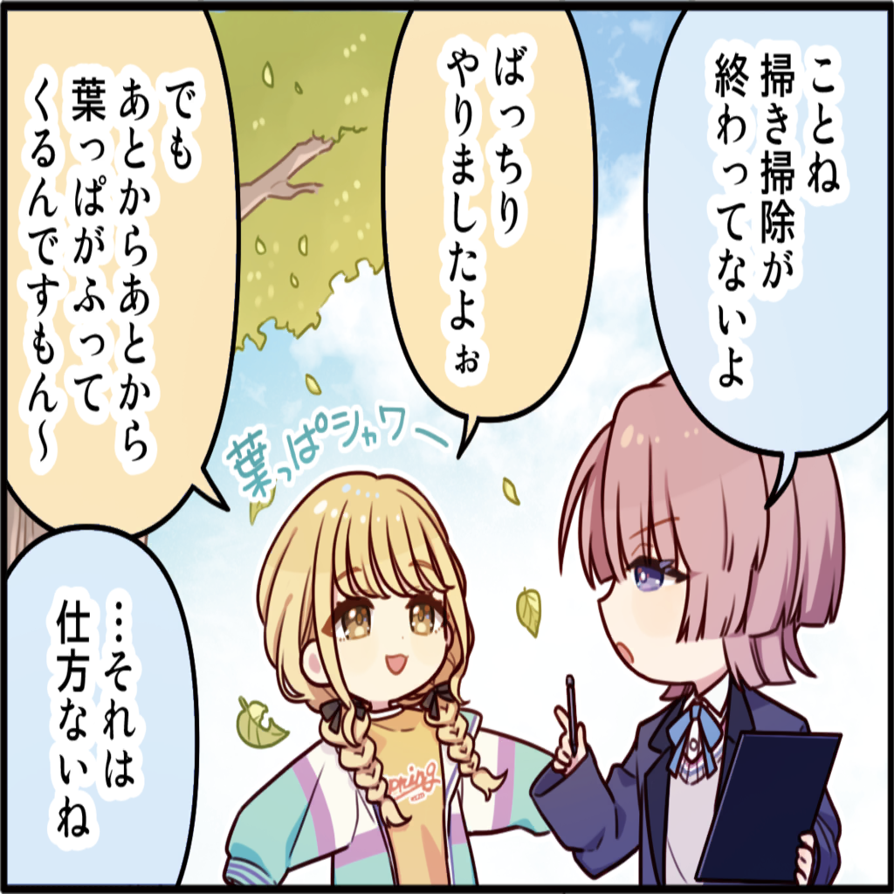
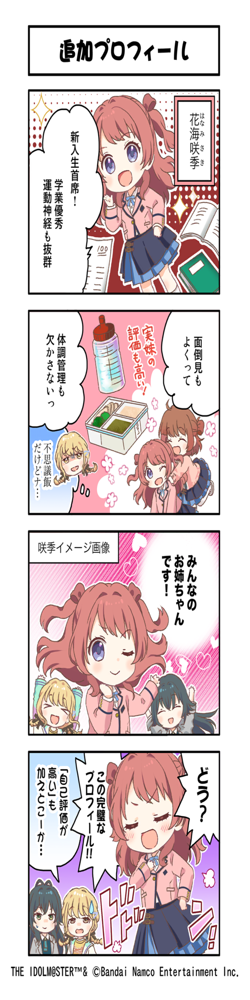
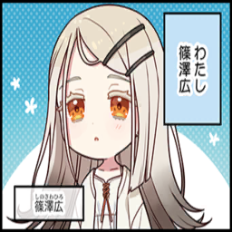
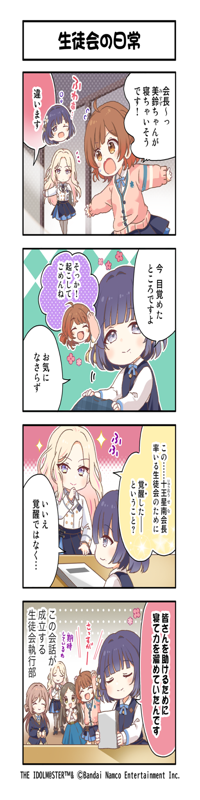
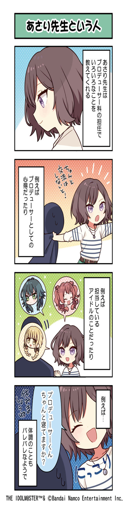
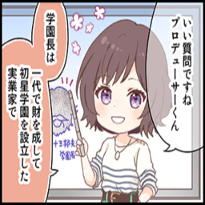
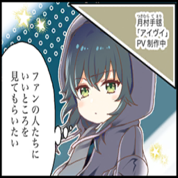

# Media
## Table of comtents

<!-- toc -->

- [Comic](#comic)
  * [お姉ちゃんだもの！](#%E3%81%8A%E5%A7%89%E3%81%A1%E3%82%83%E3%82%93%E3%81%A0%E3%82%82%E3%81%AE)
  * [手作りのお味](#%E6%89%8B%E4%BD%9C%E3%82%8A%E3%81%AE%E3%81%8A%E5%91%B3)
  * [相反する二人](#%E7%9B%B8%E5%8F%8D%E3%81%99%E3%82%8B%E4%BA%8C%E4%BA%BA)
  * [ちぐはぐ](#%E3%81%A1%E3%81%90%E3%81%AF%E3%81%90)
  * [寮長と攻防](#%E5%AF%AE%E9%95%B7%E3%81%A8%E6%94%BB%E9%98%B2)
  * [三者三様](#%E4%B8%89%E8%80%85%E4%B8%89%E6%A7%98)
  * [毎日努力中](#%E6%AF%8E%E6%97%A5%E5%8A%AA%E5%8A%9B%E4%B8%AD)
  * [絵になる二人](#%E7%B5%B5%E3%81%AB%E3%81%AA%E3%82%8B%E4%BA%8C%E4%BA%BA)
  * [可愛い後輩たち](#%E5%8F%AF%E6%84%9B%E3%81%84%E5%BE%8C%E8%BC%A9%E3%81%9F%E3%81%A1)
  * [2人きりだから…♡](#2%E4%BA%BA%E3%81%8D%E3%82%8A%E3%81%A0%E3%81%8B%E3%82%89%E2%99%A1)
  * [これでもストレッチ中](#%E3%81%93%E3%82%8C%E3%81%A7%E3%82%82%E3%82%B9%E3%83%88%E3%83%AC%E3%83%83%E3%83%81%E4%B8%AD)
  * [天才少女はナチュラルに](#%E5%A4%A9%E6%89%8D%E5%B0%91%E5%A5%B3%E3%81%AF%E3%83%8A%E3%83%81%E3%83%A5%E3%83%A9%E3%83%AB%E3%81%AB)
  * [どうしよう](#%E3%81%A9%E3%81%86%E3%81%97%E3%82%88%E3%81%86)
  * [憧れの人](#%E6%86%A7%E3%82%8C%E3%81%AE%E4%BA%BA)
  * [ふたりはなかよし♪](#%E3%81%B5%E3%81%9F%E3%82%8A%E3%81%AF%E3%81%AA%E3%81%8B%E3%82%88%E3%81%97%E2%99%AA)
  * [矢も盾もたまらず](#%E7%9F%A2%E3%82%82%E7%9B%BE%E3%82%82%E3%81%9F%E3%81%BE%E3%82%89%E3%81%9A)
  * [あの日の約束](#%E3%81%82%E3%81%AE%E6%97%A5%E3%81%AE%E7%B4%84%E6%9D%9F)
  * [同志みつけたり](#%E5%90%8C%E5%BF%97%E3%81%BF%E3%81%A4%E3%81%91%E3%81%9F%E3%82%8A)
  * [元気いっぱい！](#%E5%85%83%E6%B0%97%E3%81%84%E3%81%A3%E3%81%B1%E3%81%84)
  * [お世話したい](#%E3%81%8A%E4%B8%96%E8%A9%B1%E3%81%97%E3%81%9F%E3%81%84)
  * [カリスマ会長の内心は](#%E3%82%AB%E3%83%AA%E3%82%B9%E3%83%9E%E4%BC%9A%E9%95%B7%E3%81%AE%E5%86%85%E5%BF%83%E3%81%AF)
- [Comic4](#comic4)
  * [第1話-学マス4コマ始まります！](#%E7%AC%AC1%E8%A9%B1-%E5%AD%A6%E3%83%9E%E3%82%B94%E3%82%B3%E3%83%9E%E5%A7%8B%E3%81%BE%E3%82%8A%E3%81%BE%E3%81%99)
  * [第2話-追加プロフィール](#%E7%AC%AC2%E8%A9%B1-%E8%BF%BD%E5%8A%A0%E3%83%97%E3%83%AD%E3%83%95%E3%82%A3%E3%83%BC%E3%83%AB)
  * [第3話-厳しさの裏では…](#%E7%AC%AC3%E8%A9%B1-%E5%8E%B3%E3%81%97%E3%81%95%E3%81%AE%E8%A3%8F%E3%81%A7%E3%81%AF)
  * [第4話-多方面に忙しい](#%E7%AC%AC4%E8%A9%B1-%E5%A4%9A%E6%96%B9%E9%9D%A2%E3%81%AB%E5%BF%99%E3%81%97%E3%81%84)
  * [第5話-気が緩む瞬間](#%E7%AC%AC5%E8%A9%B1-%E6%B0%97%E3%81%8C%E7%B7%A9%E3%82%80%E7%9E%AC%E9%96%93)
  * [第6話-初星学園は自由がいっぱい](#%E7%AC%AC6%E8%A9%B1-%E5%88%9D%E6%98%9F%E5%AD%A6%E5%9C%92%E3%81%AF%E8%87%AA%E7%94%B1%E3%81%8C%E3%81%84%E3%81%A3%E3%81%AF%E3%82%9A%E3%81%84)
  * [第7話-休日の過ごし方](#%E7%AC%AC7%E8%A9%B1-%E4%BC%91%E6%97%A5%E3%81%AE%E9%81%8E%E3%81%94%E3%81%97%E6%96%B9)
  * [第8話-わたしのこと](#%E7%AC%AC8%E8%A9%B1-%E3%82%8F%E3%81%9F%E3%81%97%E3%81%AE%E3%81%93%E3%81%A8)
  * [第9話-アイドル科のいいところ](#%E7%AC%AC9%E8%A9%B1-%E3%82%A2%E3%82%A4%E3%83%89%E3%83%AB%E7%A7%91%E3%81%AE%E3%81%84%E3%81%84%E3%81%A8%E3%81%93%E3%82%8D)
  * [第10話-頑張りすぎる君に](#%E7%AC%AC10%E8%A9%B1-%E9%A0%91%E5%BC%B5%E3%82%8A%E3%81%99%E3%81%8E%E3%82%8B%E5%90%9B%E3%81%AB)
  * [第11話-プロデューサー科とは](#%E7%AC%AC11%E8%A9%B1-%E3%83%97%E3%83%AD%E3%83%87%E3%83%A5%E3%83%BC%E3%82%B5%E3%83%BC%E7%A7%91%E3%81%A8%E3%81%AF)
  * [第12話-倉本家の箱入り娘](#%E7%AC%AC12%E8%A9%B1-%E5%80%89%E6%9C%AC%E5%AE%B6%E3%81%AE%E7%AE%B1%E5%85%A5%E3%82%8A%E5%A8%98)
  * [第13話-どっちがすごいの？](#%E7%AC%AC13%E8%A9%B1-%E3%81%A9%E3%81%A3%E3%81%A1%E3%81%8C%E3%81%99%E3%81%94%E3%81%84%E3%81%AE)
  * [第14話-いつでもどこでも](#%E7%AC%AC14%E8%A9%B1-%E3%81%84%E3%81%A4%E3%81%A7%E3%82%82%E3%81%A9%E3%81%93%E3%81%A7%E3%82%82)
  * [第15話-寮のあれこれ](#%E7%AC%AC15%E8%A9%B1-%E5%AF%AE%E3%81%AE%E3%81%82%E3%82%8C%E3%81%93%E3%82%8C)
  * [第16話-学園施設へご案内♪](#%E7%AC%AC16%E8%A9%B1-%E5%AD%A6%E5%9C%92%E6%96%BD%E8%A8%AD%E3%81%B8%E3%81%94%E6%A1%88%E5%86%85%E2%99%AA)
  * [第17話-生徒会の日常](#%E7%AC%AC17%E8%A9%B1-%E7%94%9F%E5%BE%92%E4%BC%9A%E3%81%AE%E6%97%A5%E5%B8%B8)
  * [第18話-あさり先生という人](#%E7%AC%AC18%E8%A9%B1-%E3%81%82%E3%81%95%E3%82%8A%E5%85%88%E7%94%9F%E3%81%A8%E3%81%84%E3%81%86%E4%BA%BA)
  * [第19話-学園長ってどんな人？](#%E7%AC%AC19%E8%A9%B1-%E5%AD%A6%E5%9C%92%E9%95%B7%E3%81%A3%E3%81%A6%E3%81%A9%E3%82%93%E3%81%AA%E4%BA%BA)
  * [第20話-略称はSSD](#%E7%AC%AC20%E8%A9%B1-%E7%95%A5%E7%A7%B0%E3%81%AFssd)
  * [第21話-アイドル月村手毬](#%E7%AC%AC21%E8%A9%B1-%E3%82%A2%E3%82%A4%E3%83%89%E3%83%AB%E6%9C%88%E6%9D%91%E6%89%8B%E6%AF%AC)
  * [第22話-れっつパーティ](#%E7%AC%AC22%E8%A9%B1-%E3%82%8C%E3%81%A3%E3%81%A4%E3%83%91%E3%83%BC%E3%83%86%E3%82%A3)
  * [第23話-ライバルはお姉ちゃん](#%E7%AC%AC23%E8%A9%B1-%E3%83%A9%E3%82%A4%E3%83%90%E3%83%AB%E3%81%AF%E3%81%8A%E5%A7%89%E3%81%A1%E3%82%83%E3%82%93)
  * [第24話-レッスンの観客](#%E7%AC%AC24%E8%A9%B1-%E3%83%AC%E3%83%83%E3%82%B9%E3%83%B3%E3%81%AE%E8%A6%B3%E5%AE%A2)
  * [第25話-ピタッと共同生活](#%E7%AC%AC25%E8%A9%B1-%E3%83%94%E3%82%BF%E3%83%83%E3%81%A8%E5%85%B1%E5%90%8C%E7%94%9F%E6%B4%BB)

<!-- tocstop -->

## Comic
### お姉ちゃんだもの！
* Character:
	* 花海 咲季
	* 花海 佑芽
* thumbnail: 

* content:

### 手作りのお味
* Character:
	* 倉本 千奈
	* 花海 咲季
* thumbnail: 

* content:

### 相反する二人
* Character:
	* 月村 手毬
	* 秦谷 美鈴
* thumbnail: 

* content:

### ちぐはぐ
* Character:
	* 月村 手毬
* thumbnail: 

* content:

### 寮長と攻防
* Character:
	* 有村 麻央
	* 藤田 ことね
* thumbnail: 

* content:

### 三者三様
* Character:
	* 藤田 ことね
	* 花海 咲季
	* 月村 手毬
* thumbnail: 

* content:

### 毎日努力中
* Character:
	* 有村 麻央
* thumbnail: 

* content:

### 絵になる二人
* Character:
	* 有村 麻央
	* 姫崎 莉波
* thumbnail: 

* content:

### 可愛い後輩たち
* Character:
	* 姫崎 莉波
	* 倉本 千奈
	* 花海 佑芽
* thumbnail: 

* content:

### 2人きりだから…♡
* Character:
	* 姫崎 莉波
* thumbnail: 

* content:

### これでもストレッチ中
* Character:
	* 倉本 千奈
	* 篠澤 広
* thumbnail: 

* content:

### 天才少女はナチュラルに
* Character:
	* 花海 咲季
	* 篠澤 広
* thumbnail: 

* content:

### どうしよう
* Character:
	* 倉本 千奈
	* 篠澤 広
	* 花海 佑芽
* thumbnail: 

* content:

### 憧れの人
* Character:
	* 倉本 千奈
	* 十王 星南
* thumbnail: 

* content:

### ふたりはなかよし♪
* Character:
	* 紫雲 清夏
	* 葛城 リーリヤ
* thumbnail: 

* content:

### 矢も盾もたまらず
* Character:
	* 月村 手毬
	* 紫雲 清夏
* thumbnail: 

* content:

### あの日の約束
* Character:
	* 葛城 リーリヤ
	* 紫雲 清夏
* thumbnail: 

* content:

### 同志みつけたり
* Character:
	* 有村 麻央
	* 葛城 リーリヤ
* thumbnail: 

* content:

### 元気いっぱい！
* Character:
	* 藤田 ことね
	* 花海 咲季
	* 花海 佑芽
* thumbnail: 

* content:

### お世話したい
* Character:
	* 月村 手毬
	* 秦谷 美鈴
* thumbnail: 

* content:

### カリスマ会長の内心は
* Character:
	* 藤田 ことね
	* 花海 咲季
* thumbnail: 

* content:

## Comic4
### 第1話-学マス4コマ始まります！
* Character:
	* 花海 咲季
	* 月村 手毬
	* 藤田 ことね
* thumbnail: 

* content:

### 第2話-追加プロフィール
* Character:
	* 花海 咲季
	* 月村 手毬
	* 藤田 ことね
	* 花海 佑芽
* thumbnail: 

* content:

### 第3話-厳しさの裏では…
* Character:
	* 月村 手毬
	* 藤田 ことね
* thumbnail: 

* content:

### 第4話-多方面に忙しい
* Character:
	* 月村 手毬
	* 藤田 ことね
* thumbnail: 

* content:

### 第5話-気が緩む瞬間
* Character:
	* 姫崎 莉波
	* 花海 佑芽
	* 倉本 千奈
	* 十王 星南
* thumbnail: 

* content:

### 第6話-初星学園は自由がいっぱい
* Character:
	* 花海 咲季
	* 月村 手毬
	* 藤田 ことね
* thumbnail: 

* content:

### 第7話-休日の過ごし方
* Character:
	* 紫雲 清夏
	* 葛城 リーリヤ
* thumbnail: 

* content:

### 第8話-わたしのこと
* Character:
	* 篠澤 広
	* 十王 邦夫
* thumbnail: 

* content:

### 第9話-アイドル科のいいところ
* Character:
	* 花海 咲季
	* 月村 手毬
	* 藤田 ことね
* thumbnail: 

* content:

### 第10話-頑張りすぎる君に
* Character:
	* 葛城 リーリヤ
	* 有村 麻央
* thumbnail: 

* content:

### 第11話-プロデューサー科とは
* Character:
	* 花海 咲季
	* 月村 手毬
	* 藤田 ことね
	* 根緒 亜紗里
* thumbnail: 

* content:

### 第12話-倉本家の箱入り娘
* Character:
	* 倉本 千奈
* thumbnail: 

* content:

### 第13話-どっちがすごいの？
* Character:
	* 花海 咲季
	* 月村 手毬
	* 藤田 ことね
	* 倉本 千奈
	* 葛城 リーリヤ
	* 篠澤 広
	* 紫雲 清夏
* thumbnail: 

* content:

### 第14話-いつでもどこでも
* Character:
	* 有村 麻央
	* 姫崎 莉波
* thumbnail: 

* content:

### 第15話-寮のあれこれ
* Character:
	* 有村 麻央
	* 葛城 リーリヤ
	* 紫雲 清夏
	* 藤田 ことね
* thumbnail: 

* content:

### 第16話-学園施設へご案内♪
* Character:
	* 花海 咲季
	* 月村 手毬
	* 藤田 ことね
* thumbnail: 

* content:

### 第17話-生徒会の日常
* Character:
	* 花海 佑芽
	* 秦谷 美鈴
	* 十王 星南
	* 倉本 千奈
	* 姫崎 莉波
* thumbnail: 

* content:

### 第18話-あさり先生という人
* Character:
	* 花海 咲季
	* 月村 手毬
	* 藤田 ことね
	* 根緒 亜紗里
* thumbnail: 

* content:

### 第19話-学園長ってどんな人？
* Character:
	* 十王 邦夫
	* 根緒 亜紗里
* thumbnail: 

* content:

### 第20話-略称はSSD
* Character:
	* 花海 咲季
	* 月村 手毬
	* 藤田 ことね
* thumbnail: 

* content:

### 第21話-アイドル月村手毬
* Character:
	* 花海 咲季
	* 月村 手毬
	* 藤田 ことね
* thumbnail: 

* content:

### 第22話-れっつパーティ
* Character:
	* 花海 咲季
	* 月村 手毬
	* 藤田 ことね
	* 紫雲 清夏
	* 葛城 リーリヤ
* thumbnail: 

* content:

### 第23話-ライバルはお姉ちゃん
* Character:
	* 花海 咲季
	* 花海 佑芽
* thumbnail: 

* content:

### 第24話-レッスンの観客
* Character:
	* 藤田 ことね
* thumbnail: 

* content:

### 第25話-ピタッと共同生活
* Character:
	* 花海 咲季
	* 月村 手毬
	* 藤田 ことね
* thumbnail: 

* content:

